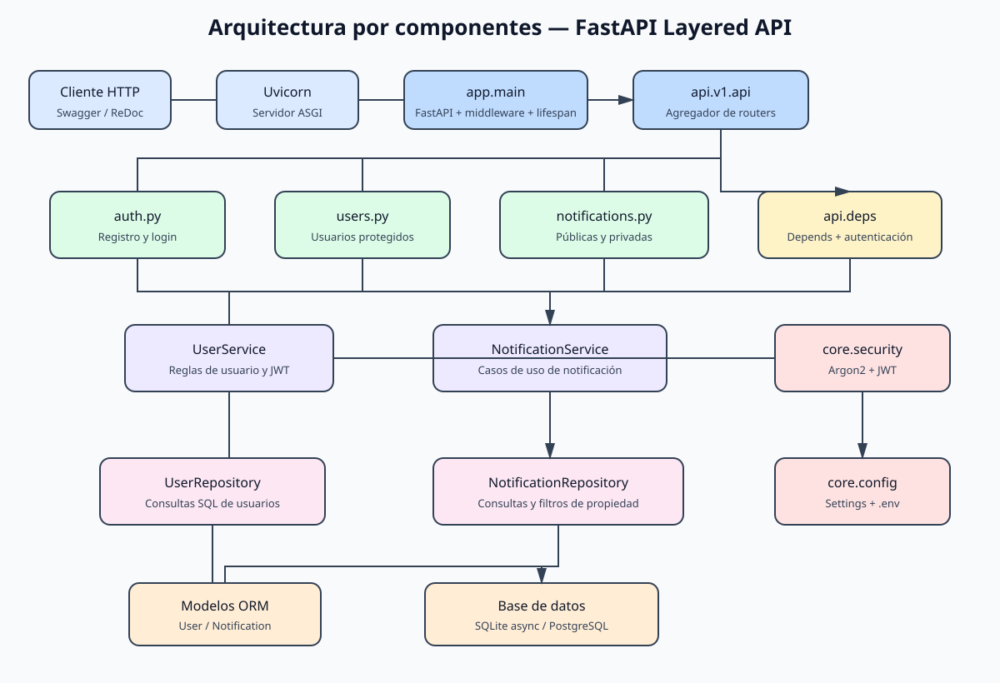
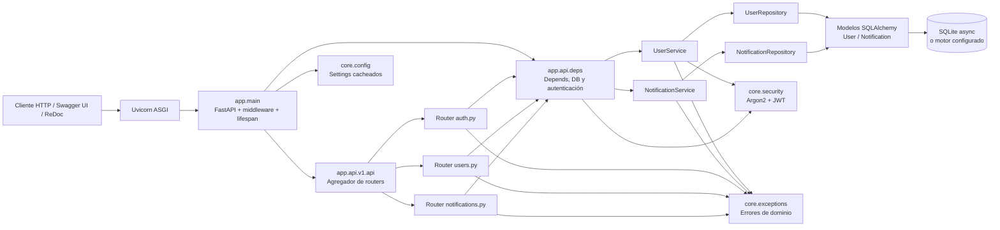
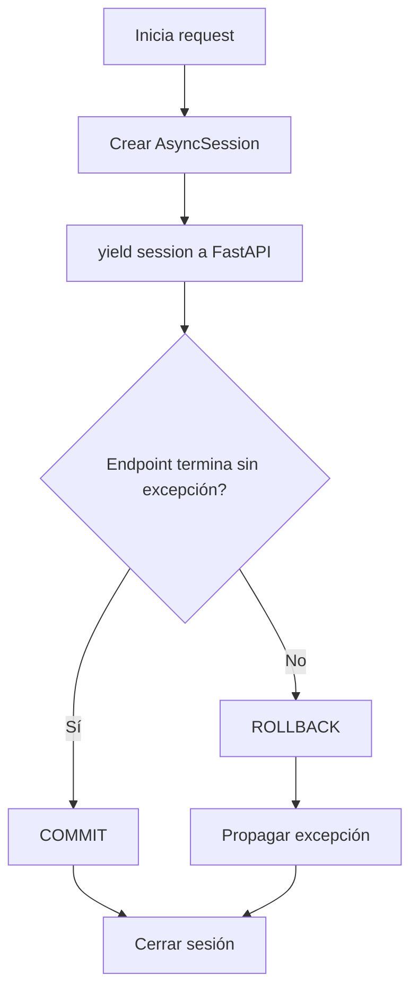
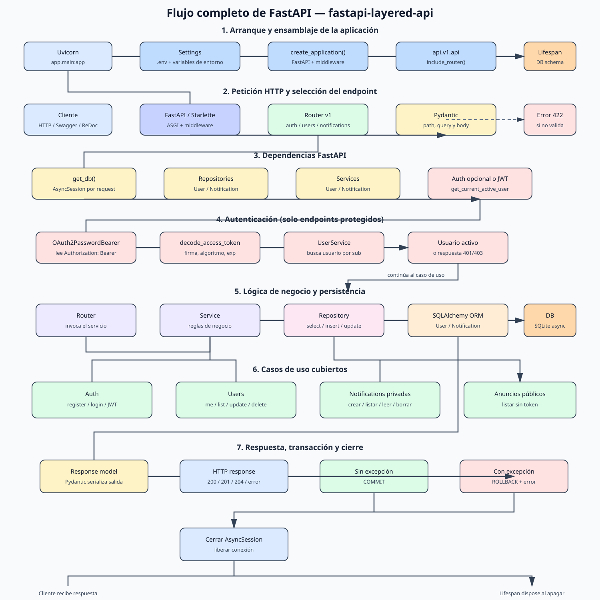
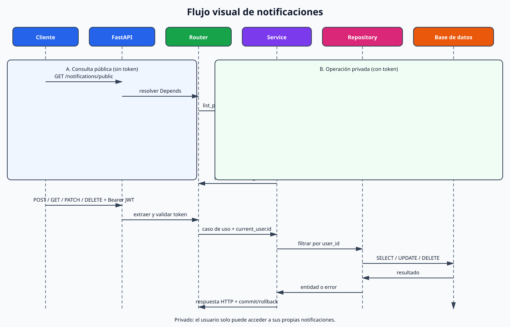
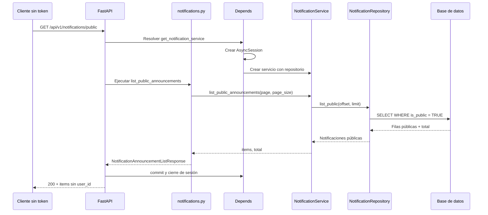
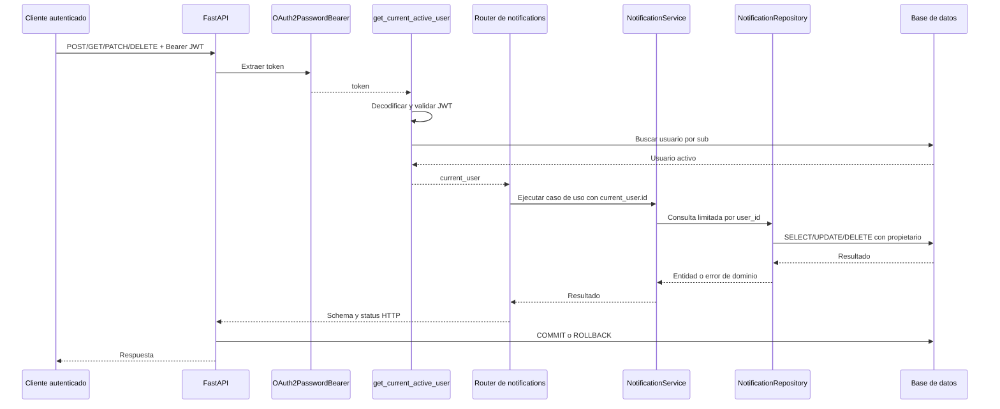

# Análisis de FastAPI y de la implementación de notificaciones

## 1. Propósito del documento

Este documento describe mediante ingeniería inversa cómo funciona el proyecto
`fastapi-layered-api`: cómo inicia FastAPI, cómo se registran los routers, cómo
se valida una petición, cómo se autentica un usuario, cómo se ejecutan las
capas de servicio y persistencia, y cómo se confirma o revierte una
transacción.

También documenta la entidad `Notification`, incluyendo la diferencia entre:

- operaciones privadas, que requieren autenticación y están limitadas al
  usuario propietario;
- consulta pública de anuncios, que no requiere autenticación y solo expone
  registros marcados con `is_public=True`.

El archivo está ubicado en la raíz del proyecto, fuera de `app/` y `tests/`.

---

## 2. Estructura y responsabilidad de cada carpeta

```text
fastapi-layered-api/
├── app/
│   ├── main.py
│   ├── core/
│   │   ├── config.py
│   │   ├── security.py
│   │   └── exceptions.py
│   ├── db/
│   │   ├── base.py
│   │   └── session.py
│   ├── models/
│   │   ├── user.py
│   │   └── notification.py
│   ├── schemas/
│   │   ├── auth.py
│   │   ├── common.py
│   │   ├── user.py
│   │   └── notification.py
│   ├── repositories/
│   │   ├── user_repository.py
│   │   └── notification_repository.py
│   ├── services/
│   │   ├── user_service.py
│   │   └── notification_service.py
│   └── api/
│       ├── deps.py
│       └── v1/
│           ├── api.py
│           └── routers/
│               ├── auth.py
│               ├── users.py
│               └── notifications.py
├── tests/
├── requirements.txt
├── .env.example
├── Dockerfile
└── analisis de fastapi.md
```

La dirección principal de dependencias es:

```text
HTTP -> Router/API -> Service -> Repository -> SQLAlchemy/Database
```

La dependencia fluye hacia adentro. Los repositorios no conocen HTTP, los
servicios no lanzan `HTTPException` y los modelos ORM no se devuelven
directamente al cliente.

---

## 3. Arranque de la aplicación

El punto de entrada es `app.main:app`.

### 3.1 Carga de configuración

`app/core/config.py` define `Settings` con `pydantic-settings`.

- Lee variables de entorno y opcionalmente `.env`.
- Exige `SECRET_KEY`.
- Define `DATABASE_URL`, el algoritmo JWT, expiración del token, CORS y
  metadatos de la aplicación.
- `get_settings()` está decorado con `lru_cache`, por lo que devuelve una
  configuración reutilizable y no vuelve a leer el archivo en cada petición.

La configuración predeterminada usa:

```text
sqlite+aiosqlite:///./app.db
```

El diseño permite cambiar el motor por otro driver asíncrono modificando
`DATABASE_URL`, sin cambiar los servicios ni los routers.

### 3.2 Creación de la aplicación

`create_application()` construye la instancia `FastAPI` y configura:

1. metadatos OpenAPI;
2. CORS si existen orígenes configurados;
3. `GZipMiddleware` para respuestas grandes;
4. un manejador global de `DomainError`;
5. el router versionado bajo `/api/v1`;
6. el endpoint transversal `/health`;
7. el ciclo de vida `lifespan`.

La instancia global `app = create_application()` es la que utiliza Uvicorn.

### 3.3 Ciclo de vida

Al iniciar la aplicación, `lifespan` ejecuta:

```python
await conn.run_sync(Base.metadata.create_all)
```

Esto crea las tablas conocidas por `Base.metadata`. `app/models/__init__.py`
importa `User` y `Notification`, asegurando que ambos modelos estén
registrados antes de crear las tablas.

Al apagar la aplicación se ejecuta `await engine.dispose()`, liberando las
conexiones del motor.

En producción sería preferible utilizar migraciones versionadas con Alembic,
pero en este proyecto educativo el esquema se crea automáticamente.

---

## 4. Diagrama completo de componentes

### Imagen visual



La imagen puede abrirse directamente en el navegador o en VS Code. El bloque
Mermaid siguiente conserva la versión editable del diagrama.



### Responsabilidad de los componentes

| Componente | Responsabilidad |
|---|---|
| Uvicorn | Servidor ASGI que entrega peticiones a FastAPI. |
| `main.py` | Ensamblaje, middleware, lifespan y errores globales. |
| Routers | HTTP, parámetros, schemas, códigos de estado y autorización. |
| `deps.py` | Inyección de sesión, repositorios, servicios y usuario actual. |
| Services | Reglas de negocio y orquestación. |
| Repositories | Consultas SQLAlchemy y mutaciones de persistencia. |
| Models | Mapeo de tablas y relaciones ORM. |
| Schemas | Contratos de entrada y salida Pydantic. |
| `security.py` | Hash Argon2, emisión y validación JWT. |
| `session.py` | Engine async y transacción por petición. |
| Database | Almacenamiento de usuarios y notificaciones. |

---

## 5. Inyección de dependencias de FastAPI

Las funciones de `app/api/deps.py` construyen una cadena de dependencias:

```text
get_db
  -> get_notification_repository
      -> get_notification_service

get_db
  -> get_user_repository
      -> get_user_service
          -> get_current_user
              -> get_current_active_user
```

Cuando un endpoint declara:

```python
service: Annotated[
    NotificationService,
    Depends(get_notification_service),
]
```

FastAPI resuelve recursivamente toda la cadena antes de ejecutar la función
del endpoint. No es necesario instanciar manualmente sesiones, repositorios o
servicios dentro del router.

La misma técnica hace posible sustituir `get_db` en los tests mediante
`app.dependency_overrides`.

---

## 6. Sesión y transacciones

`app/db/session.py` crea un `AsyncEngine` y una fábrica
`AsyncSessionLocal`.

Características importantes:

- acceso asíncrono mediante SQLAlchemy y `aiosqlite`;
- una sesión por request;
- `expire_on_commit=False` para poder serializar objetos después del commit;
- `autoflush=False` para que el flujo sea explícito;
- `check_same_thread=False` cuando se utiliza SQLite.

`get_db()` implementa un Unit of Work a nivel de petición:



Los repositorios realizan `flush()` para obtener IDs generados y actualizar
objetos dentro de la transacción, pero no hacen `commit()`. El commit queda
centralizado al finalizar el request. Así se evita confirmar parcialmente
una operación compuesta.

---

## 7. Modelos y relación de datos

### 7.1 `User`

La tabla `users` contiene:

- `id`: clave primaria;
- `email`: único e indexado;
- `full_name`;
- `hashed_password`: nunca se expone por la API;
- `is_active`;
- `is_superuser`;
- `created_at`;
- `updated_at`.

### 7.2 `Notification`

La tabla `notifications` contiene:

- `id`: clave primaria;
- `user_id`: clave foránea hacia `users.id`;
- `message`: texto de 1 a 500 caracteres;
- `is_read`: indica si fue marcada como leída;
- `is_public`: identifica anuncios consultables sin autenticación;
- `created_at`.

La relación es:

```text
User 1 ─────────── N Notification
```

`ondelete="CASCADE"` indica que al eliminarse el usuario también pueden
eliminarse sus notificaciones dependientes, según las capacidades del motor
de base de datos.

`Notification` siempre se crea desde el servicio con el `user_id` del usuario
autenticado. El cliente no controla el propietario de la notificación.

---

## 8. Schemas Pydantic y control de exposición

Los schemas separan el modelo interno de los contratos HTTP.

### Notificaciones privadas

`NotificationCreate` acepta únicamente:

```json
{
  "message": "Texto de la notificación"
}
```

El servidor completa `user_id`, `is_read`, `is_public` y `created_at`.

`NotificationPublic` devuelve:

```text
id, user_id, message, is_read, is_public, created_at
```

### Anuncios públicos

`NotificationAnnouncement` devuelve deliberadamente solo:

```text
id, message, created_at
```

No incluye `user_id` ni `is_read`. Aunque la consulta se ejecute sobre el
mismo modelo ORM, el contrato público reduce los datos expuestos y evita
revelar información de usuarios.

`ConfigDict(from_attributes=True)` permite construir los schemas desde
instancias SQLAlchemy sin convertirlas manualmente a diccionarios.

---

## 9. Autenticación y autorización

### 9.1 Registro

`POST /api/v1/auth/register` recibe JSON validado por `UserCreate`.

Flujo:

1. el router recibe la petición;
2. `UserService.register()` consulta si el email ya existe;
3. la contraseña se transforma con Argon2;
4. `UserRepository.create()` persiste el usuario;
5. `UserPublic` elimina la contraseña de la respuesta;
6. se responde `201 Created`.

Si el email existe, se lanza `UserAlreadyExistsError` y el router responde
`409 Conflict`.

### 9.2 Login

`POST /api/v1/auth/login` utiliza `OAuth2PasswordRequestForm`, por lo que
recibe `application/x-www-form-urlencoded`:

```text
username=<email>&password=<contraseña>
```

El servicio:

1. busca el email;
2. verifica la contraseña con Argon2;
3. valida que el usuario esté activo;
4. crea un JWT con `sub`, `iat` y `exp`.

Si el usuario no existe se verifica un hash señuelo. Esto mantiene un coste de
cómputo similar y dificulta la enumeración de usuarios por tiempo de respuesta.

### 9.3 Resolución del usuario actual

`OAuth2PasswordBearer` extrae el token Bearer del header:

```text
Authorization: Bearer <jwt>
```

`get_current_user()`:

1. decodifica el token;
2. valida firma, algoritmo y expiración;
3. lee `sub`;
4. busca ese ID en la base de datos.

`get_current_active_user()` añade la regla de que `is_active` debe ser
verdadero. Los endpoints privados usan esta dependencia.

### 9.4 Autorización a nivel de objeto

Para usuarios, `_ensure_self_or_superuser()` permite acceso si:

```text
current_user.id == target_user_id
        o
current_user.is_superuser == True
```

Para notificaciones, el repositorio usa consultas que combinan:

```sql
WHERE notifications.id = :notification_id
  AND notifications.user_id = :current_user_id
```

Por tanto, una notificación ajena se comporta como inexistente y produce
`404`, evitando que un usuario modifique o elimine datos de otro.

---

## 10. Funcionalidad completa de `Notification`

### 10.1 Crear una notificación

```text
POST /api/v1/notifications
Authorization: Bearer <token>
Content-Type: application/json
```

El router obtiene `current_user.id` y lo pasa al servicio. El payload no
puede seleccionar otro propietario.

Resultado normal: `201 Created`.

### 10.2 Listar las notificaciones propias

```text
GET /api/v1/notifications?page=1&page_size=20&is_read=false
Authorization: Bearer <token>
```

El repositorio filtra siempre por `user_id`. `is_read` es un filtro opcional.
La respuesta incluye `items`, `total`, `page` y `page_size`.

La paginación calcula:

```text
offset = (page - 1) * page_size
```

Los resultados se ordenan por `created_at` descendente.

### 10.3 Marcar como leída

```text
PATCH /api/v1/notifications/{notification_id}/read
Authorization: Bearer <token>
```

El servicio busca la notificación usando ID y propietario. Si existe, cambia
`is_read` a `True`; si no existe o pertenece a otro usuario, responde `404`.

### 10.4 Eliminar

```text
DELETE /api/v1/notifications/{notification_id}
Authorization: Bearer <token>
```

La eliminación también valida el propietario antes de llamar al repositorio.
Resultado normal: `204 No Content`.

### 10.5 Consultar anuncios públicos

```text
GET /api/v1/notifications/public?page=1&page_size=20
```

Este endpoint no declara `Depends(get_current_active_user)`, por lo tanto no
exige token. Sí utiliza `get_notification_service`, porque necesita acceso a
la base de datos.

El repositorio aplica:

```sql
WHERE notifications.is_public IS TRUE
```

Nunca devuelve notificaciones privadas y el schema de salida tampoco incluye
`user_id`.

---

## 11. Diagrama de flujo completo de FastAPI

### Imagen visual completa



Esta imagen muestra el flujo completo de la aplicación: arranque, configuración,
registro de routers, recepción de la petición, validación Pydantic, inyección de
dependencias, autenticación opcional o JWT, servicios, repositorios, ORM,
base de datos, serialización de la respuesta, commit/rollback y cierre de la
sesión.

El diagrama visual específico de notificaciones se conserva aquí como detalle
de un módulo concreto:



Los diagramas Mermaid siguientes conservan el detalle secuencial de los
endpoints de notificaciones.



Punto importante: no se ejecuta `get_current_active_user`; por eso la ausencia
del header de autorización es intencional, no un error.

---

## 12. Diagrama de flujo: operación privada



Si el token es inválido, falta, está vencido o el usuario está inactivo, el
flujo se detiene antes de entrar al caso de uso.

---

## 13. Mapa de endpoints

| Método | Ruta | Auth | Resultado |
|---|---|---:|---|
| `GET` | `/health` | No | Estado del servicio |
| `POST` | `/api/v1/auth/register` | No | Crea usuario |
| `POST` | `/api/v1/auth/login` | No | Devuelve JWT |
| `GET` | `/api/v1/users/me` | Sí | Usuario autenticado |
| `GET` | `/api/v1/users` | Sí | Usuarios paginados |
| `GET` | `/api/v1/users/{id}` | Sí | Propio o superusuario |
| `PUT` | `/api/v1/users/{id}` | Sí | Actualiza propio o autorizado |
| `DELETE` | `/api/v1/users/{id}` | Sí | Elimina propio o autorizado |
| `GET` | `/api/v1/notifications/public` | No | Anuncios públicos |
| `POST` | `/api/v1/notifications` | Sí | Crea notificación propia |
| `GET` | `/api/v1/notifications` | Sí | Lista notificaciones propias |
| `PATCH` | `/api/v1/notifications/{id}/read` | Sí | Marca propia como leída |
| `DELETE` | `/api/v1/notifications/{id}` | Sí | Elimina notificación propia |

FastAPI usa estas definiciones para generar automáticamente `/docs`,
`/redoc` y el esquema OpenAPI.

---

## 14. Manejo de errores

Las capas internas lanzan excepciones de dominio:

- `UserAlreadyExistsError`;
- `UserNotFoundError`;
- `InvalidCredentialsError`;
- `InactiveUserError`;
- `NotificationNotFoundError`.

Los routers traducen las excepciones conocidas a `HTTPException`:

| Situación | Estado |
|---|---:|
| Credenciales ausentes o inválidas | `401 Unauthorized` |
| Usuario inactivo | `401 Unauthorized` en login o `403` según dependencia |
| Recurso ajeno | `403` para usuarios; `404` para notificaciones |
| Recurso inexistente | `404 Not Found` |
| Email duplicado | `409 Conflict` |
| Datos inválidos | `422 Unprocessable Entity` |

El manejador global de `DomainError` responde `400` como red de seguridad si
un router no traduce explícitamente una excepción de dominio. No se exponen
trazas internas al cliente.

---

## 15. Testing y validación

Los tests utilizan:

- `pytest`;
- `pytest-asyncio`;
- `httpx.AsyncClient`;
- SQLite en memoria;
- `ASGITransport`;
- `app.dependency_overrides[get_db]`.

No necesitan levantar Uvicorn ni conectarse a la base de datos de desarrollo.
Cada fixture crea las tablas sobre una base aislada y entrega una
`AsyncSession` de prueba.

Los casos de notificaciones validan:

1. crear requiere autenticación;
2. crear y listar funciona para el usuario autenticado;
3. marcar como leída funciona;
4. un segundo usuario no puede marcar una notificación ajena;
5. eliminar deja la colección vacía;
6. `/notifications/public` funciona sin token;
7. los anuncios privados no aparecen en el endpoint público;
8. `user_id` no se expone en la vista pública.

La validación ejecutada para esta implementación fue:

```text
14 passed
```

También se comprobó que el diff no contiene errores de espacios o formato con
`git diff --check`.

---

## 16. Decisiones de diseño relevantes

### Separar modelos y schemas

Evita que `hashed_password` u otros campos internos se serialicen por
accidente. También permite que el endpoint público tenga una vista más
restrictiva que el endpoint privado.

### No permitir `user_id` en `NotificationCreate`

El propietario se obtiene del token, no del JSON del cliente. Esto evita que
un usuario cree directamente una notificación asignada a otra cuenta.

### Filtrar propiedad en la consulta SQL

La propiedad se comprueba dentro del repositorio, no únicamente en memoria.
Así todos los casos de lectura, actualización y eliminación mantienen la
misma barrera de autorización.

### Mantener el endpoint público separado

`/notifications/public` no reutiliza el listado privado con un usuario
anónimo. Tiene su propio método de repositorio y su propio schema, lo que
hace explícita la política de exposición.

### Confirmar la transacción en el límite HTTP

La sesión se confirma una vez que todo el caso de uso termina correctamente.
Ante cualquier excepción se hace rollback y se propaga el error.

---

## 17. Ejecución local

Desde la raíz del proyecto:

```bash
python3 -m venv .venv
source .venv/bin/activate
pip install -r requirements.txt
```

Configurar al menos `SECRET_KEY` en `.env` y ejecutar:

```bash
uvicorn app.main:app --reload
```

URLs disponibles:

```text
http://127.0.0.1:8000/docs
http://127.0.0.1:8000/redoc
http://127.0.0.1:8000/health
```

Para ejecutar las pruebas:

```bash
.venv/bin/pytest -q
```

---

## 18. Evolución recomendada hacia producción

El código funciona como implementación educativa y validada, pero para
producción conviene:

1. reemplazar `Base.metadata.create_all` por migraciones Alembic;
2. usar PostgreSQL con `asyncpg`;
3. configurar secretos mediante un gestor seguro;
4. añadir refresh tokens y revocación;
5. aplicar rate limiting;
6. agregar logging estructurado y request IDs;
7. incorporar linting y type checking en CI/CD;
8. agregar índices y políticas de retención si el volumen de notificaciones
   crece;
9. definir una política explícita para quién puede crear anuncios
   `is_public=True`;
10. añadir pruebas de paginación, expiración de JWT y usuarios inactivos.
